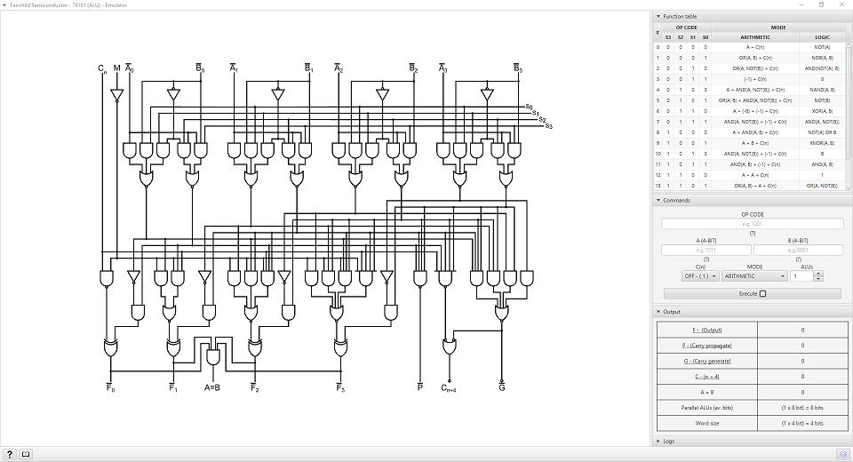
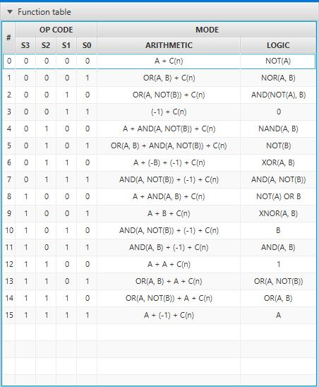
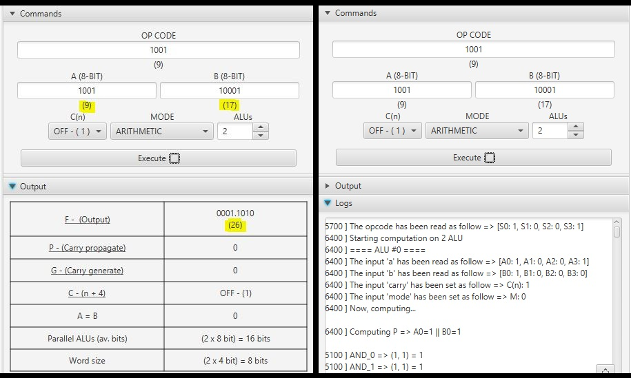
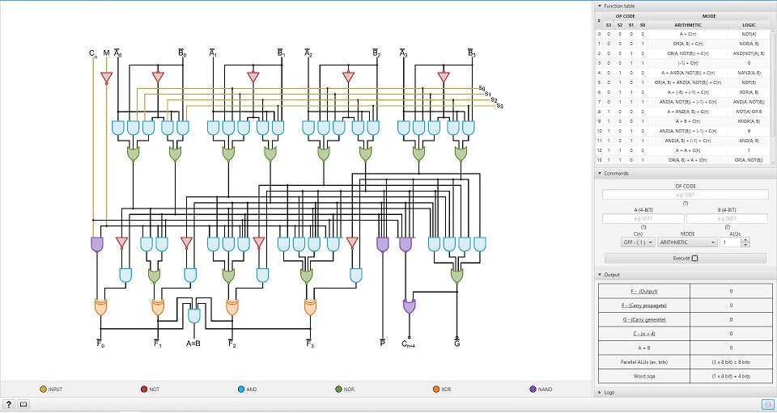
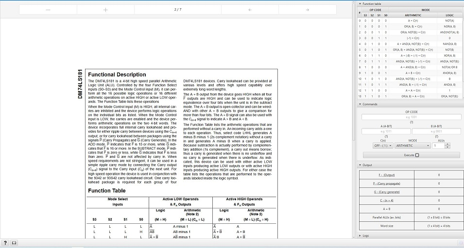

# TTL74181 Emulator

## Table of Contents
- [Introduction](#introduction)
- [Features](#features)
- [Screen-shots](#screen-shots)
- [Build, download & changelog](#build-download--changelog)
- [Feedback](#feedback)
- [License](#license)

## Introduction

This software has been mainly developed while I was studying
"Computer Architecture and Operating Systems" at the university.

The alu is a component I find fascinating.
Its design is ingenious, and the way it has changed computers is incredible.  

I found on YouTube a video made by "CrashCourse - The Mechanics of How Computers Work",  
which introduced the chip TTL74181 as the first ALU implemented as an integrated circuit.  

From here, I started looking for datasheets on the TTL74181 and looking for manuals.   
This software is an emulator and the result of the study that I conducted for pure fun on this component so interesting.  

## Features

The following software includes:
- **Arithmetic and logic mode** emulation
- **Multi-ALU support** (x2, x4, x8)
- **Function table** with all opcodes and their description
- **Command prompt** to execute manually each operation
- **Output window** with many details
- **Multi-layer mode** which highlights the most important logic gates
- **Documentation view** inside the software (yep, it's true)
- **Log window** (So you can export the calculation eventually...)

## Screen-shots

### Window

<p align="center">
  
</p>

### Function table

<p align="center">
  
</p>

### Commands & logs

In this example, the ALU is doing a **simple sum** (A + B = F) where A = 9 and B = 17  

<p align="center">
  
</p>

### Multi-layer mode

<p align="center">
  
</p>

### Documentation view

<p align="center">
  
</p>

## Build, download & changelog

#### Building the jar

TTL74181 requires Gradle 6.4.1, JDK 11 and JavaFX 11.<br>
The generated JARs is compatible only with Java 11 and higher.

Each platform requires different dependencies, so by default,  
**the target platform is Windows**.

**In order to build a jar for a different platform**,  
you have to rename the variable 'targetPlatform' inside build.gradle to one of the following values:
- _win_
- _mac_
- _linux_

Build command:

````
gradle clean jar
````

The ***build / libs***  directory with the JAR will be available at the root directory.  
If you have chosen the correct profile you will find inside the target
directory **one fat jar**:
- TTL74181 - (platform_name).jar (**with dependencies** included)

#### Download

You can get the latest precompiled .jar files (Win, Mac & Linux)
from [this page](https://github.com/MrSnix/TTL74181/releases).

To run, simply execute:
`java -jar <filename>`

#### Tracking changes

The full changelog and planned features are available at [CHANGELOG.md](CHANGELOG.md),  
meanwhile the following table is a really short feature-list for each
release.

<br>

| Version |                      Changelog                           |
|:-------:|:--------------------------------------------------------:|
|   0.1   |                   Initial release                        |

## Feedback
If there's anything you'd like to chat about, or 
you want to send me feedback about this project,  
you can reach me on my [e-mail](mailto:baittiner.giuseppe.dev@gmail.com), 
***feature requests are always welcome***.

## License

Copyright (C) 2020  Giuseppe Baittiner

This program is free software: you can redistribute it and/or modify
it under the terms of the GNU General Public License as published by
the Free Software Foundation, either version 3 of the License, or
(at your option) any later version.

This program is distributed in the hope that it will be useful,
but WITHOUT ANY WARRANTY; without even the implied warranty of
MERCHANTABILITY or FITNESS FOR A PARTICULAR PURPOSE. See the
GNU General Public License for more details.